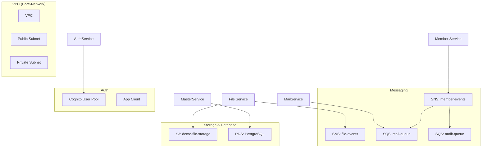

# Resource Model: AWS CDK Infrastructure

Mô tả mối quan hệ giữa các tài nguyên AWS được định nghĩa trong stack.

## 1. Sơ đồ tài nguyên (Resource Relationships)

## 2. Danh sách tài nguyên (Entities)

- **VPC Entity**: Đóng vai trò là "container" cho toàn bộ hệ thống.
- **Messaging Entities**:
    - `member-events`: Topic truyền tin khi có sự thay đổi member.
    - `mail-queue`: Queue lắng nghe từ topic để kích hoạt gửi mail.
- **Storage Entities**:
    - `demo-file-storage`: Lưu trữ file vật lý (PDF, Image).
- **Identity Entities**:
    - `demo-user-pool`: Quản lý danh tính người dùng.
